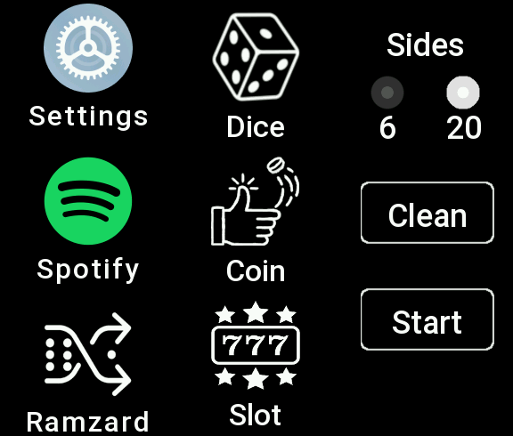

# Ramzard

## Index
1. [About Ramzard](#about-ramzard)
2. [Features](#features)
   - [Dice Roller](#dice-roller)
   - [Coin Toss](#coin-toss)
   - [Slot Machine (Caçaniquel)](#slot-machine-caçaniquel)
   - [Code Generator](#code-generator)
3. [History and Customization](#history-and-customization)
4. [How to Use](#how-to-use)
5. [Installation](#installation)
6. [Additional Uses](#additional-uses)
   - [Icebreaker](#icebreaker)
   - [Classroom Engagement](#classroom-engagement)
   - [Group Games](#group-games)
7. [Contribute](#contribute)
8. [License](#license)
9. [Get Started](#get-started)
10. [Connect with Us](#connect-with-us)
11. [Credits](#credits)

## About Ramzard:

  

Ramzard is a versatile and intuitive application designed for the Mi Band 7, providing a seamless experience for users who seek randomness in decision-making and fun activities. The name "Ramzard" is a fusion of "random" and "haphazard," perfectly encapsulating the app's essence.

## Features:

1. **Dice Roller:**
   - Configure the number of sides on the dice for fair and dynamic decision-making.
   - Ideal for choosing someone randomly or adding an element of chance to games.

2. **Coin Toss:**
   - Set the number of rounds for a coin toss decision-making process.
   - Perfect for quick and easy choices, such as deciding between two options.

3. **Slot Machine:**
   - Adjust the probability of winning in the slot machine game.
   - Use it to make decisions or add an element of suspense to your choices.

4. **Code Generator:**
   - Generate alphanumeric codes or passphrases effortlessly.
   - Ideal for creating secure passwords or adding a random touch to your digital security.

## History and Customization:
   - View a detailed history of each function, sorted by date.
   - Easily delete the history for a fresh start in each function.

## How to Use:

- Simply select the desired function, configure settings, and let Ramzard add an exciting element of randomness to your decisions and activities.

## Installation:
   - Download the [bin file](https://github.com/xyanlucasx/Ramzard-MiBand7/releases/download/0.0.1/Ramzard-MiBand7_0.0.1.bin) in releases and transfer to phone using the android app [Mi Band 7 Watch Faces](https://play.google.com/store/apps/details?id=asn.ark.miband7&hl=pt_BR&gl=US). Transfer as if you were transferring a watchface through a file.

## Additional Uses:
   - Icebreaker: Use the app to break the ice in social settings or meetings by introducing a random element to discussions.
   - Classroom Engagement: Teachers can utilize the dice roller for random student selection or create fun challenges using the coin toss feature.
   - Group Games: Enhance various group games by incorporating the slot machine or dice roller for unpredictable outcomes.

## Contribute:

In the future, this section will be updated with more information to assist in getting started with development for Mi Band 7. Getting started may be a bit challenging initially due to the lack of information on the internet. In the meantime, here are some links below that may help kickstart your journey:

- [Documentation](https://docs.zepp.com/docs/1.0/guides/quick-start/)
- [Russian forum](https://4pda.to/forum/index.php?showtopic=1051698)
- [Chinese forum](https://www.bandbbs.cn/forums/mb7/)

Feel free to explore these resources as you embark on your Mi Band 7 development adventure. Stay tuned for more updates in this section!

## License:
   - Ramzard is open-source and licensed under [GNU General Public License v3.0](https://github.com/gogs/gogs/blob/main/conf/license/GNU%20General%20Public%20License%20v3.0).

## Credits:
   - Developed by Yan Lucas.
   - [Github](https://github.com/xyanlucasx/Ramzard-MiBand7)
